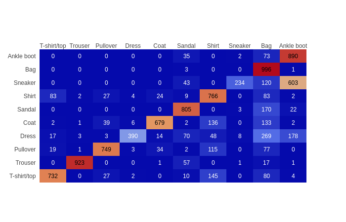

# Fashion-MNIST Keras

[comment]: # (https://askubuntu.com/questions/648603/how-to-create-an-animated-gif-from-mp4-video-via-command-line)

`Fashion-MNIST` veriseti [Zalando Research](https://jobs.zalando.com/tech/) tarafından MNIST verisetine alternatif olarak oluşturulmuştur. 60.000 tane eğitim 10.000 tane test verisi bulunmaktadır. 28x28 gri seviyesinde 10 farklı sınıftan oluşmaktadır.

İçerik

* [Etiketler](#etiketler)
* [Kurulum](#kurulum)
* [Sonuclar](#sonuclar)
* [Görsellestirme](#tahminleri-gorsellestirme)
* [Kohen Kappa Scores](#kohen-kappa-scores)

## Etiketler
Eğitim ve test verisindeki etiktler ve açıklamaları:

| Etiket | Açıklama |
| --- | --- |
| 0 | T-shirt/top |
| 1 | Trouser |
| 2 | Pullover |
| 3 | Dress |
| 4 | Coat |
| 5 | Sandal |
| 6 | Shirt |
| 7 | Sneaker |
| 8 | Bag |
| 9 | Ankle boot |

## Kurulum
### 1) Ubuntu 18.04 için Docker kurulumu: (https://docs.docker.com/install/linux/docker-ce/ubuntu/)    
* sudo apt-get update   
* sudo apt-get install 
    apt-transport-https 
    ca-certificates 
    curl 
    software-properties-common   
* curl -fsSL https://download.docker.com/linux/ubuntu/gpg | sudo apt-key add -   
* sudo apt-key fingerprint 0EBFCD88   
* sudo add-apt-repository 
   "deb [arch=amd64] https://download.docker.com/linux/ubuntu 
   $(lsb_release -cs)
   stable"   
* sudo apt-get update   
* sudo apt-get install docker-ce   

### Örnek Docker
Aşağıdaki komut çalışıyorsa docker kurulumu düzgün bir şekilde yapılmış demektir.  
sudo docker run hello-world

### 2) Keras için hazırlanmış Docker'ın kurulması. CPU için docker var. GPU docker'ı gelecekte hazırlanacak.
cd docker  
sudo docker build -t keras:cpu -f Dockerfile_keras.cpu .  
cd ..

### 3) Docker'ı çalıştırma
sudo docker run -p 8888:8888 -v $(pwd):/notebook -it keras:cpu  
Jupyter notebook 8888 portu localhost'a yönlendirilir.  
-v komutu lokal makinada hangi dizinde çalıcağını gösterir   

sudo docker ps -a --> Çalışan container'ların listesini döner  
sudo docker logs 2d8b574f5c41(containerID seçilir) --> jupyter notebook için authentication token alınır.   
Hazırlanan docker için token'a gerek yok. 127.0.0.1:8888 adresinden direk ulaşılabilir.  
Token üzerinden gitmek isteyenler dockerfile'daki --NotebookApp.token= parametresini silmeleri yeterlidir.  
 :))

### 4) Notebook klasörü altındaki cnn.ipynb seçilerek çalıştırılabilir.

## Sonuclar
Sonuçlar kısmında her bir algoritma için ilk satırda yer alan accuracy, loss ve confussion matrisleri 20 epoch ve data augmentation yapılmamış sonuçları anlatamaktadır.  
İkinci satırdaki sonuçlar ise 50 epoch ve data augmentation sonucu elde edilen sonuçları içermektedir. Ek olarak ikinci satırda overfit olmasını engellemek için EarlyStopping kullanılmıştır.  
Test sonuçlarında yer alan tabloda '_dataAug' data augmentation yapıldığı anlamına gelmektedir.

### Test Sonuçları
| Model Adı               | test_acc |
|-------------------------|----------|
| simpleVGG_dataAug       | 0.9439   |
| majority_voting         | 0.9429   |
| simpleVGG               | 0.9366   |
| wideResnet_dataAug      | 0.9333   |
| CNNBatchNorm            | 0.9333   |
| wideResnet              | 0.927    |
| simpleResnet_dataAug    | 0.925    |
| CNNDropout              | 0.921    |
| stacking                | 0.9204   |
| simpleResnet            | 0.9181   |
| simpleInception         | 0.9167   |
| mobileNetV2_dataAug     | 0.9157   |
| mobileNetV2             | 0.9145   |
| simpleCNN_dataAug       | 0.9097   |
| simpleCNN               | 0.9076   |
| CNNBatchNorm_dataAug    | 0.9049   |
| mlp                     | 0.8917   |
| CNNDropout_dataAug      | 0.8874   |
| simpleInception_dataAug | 0.7164   |

### Multi Layer Perceptron

### Simple CNN

### CNN with Dropout

### CNN + Dropout + BatchNormalization

### Simple VGG

### Simple Inception

### Simple Resnet

### WideResnet

### MobileNet_v2

## Kohen Kappa Scores
Kappa skorları incelendiğinde modellerin birbirine benzer sonuçlar ürettiği için ensemble tekniklerinin stacking ve majority voting normal algoritmaların performansını geçemediği görülmüştür.

## Tahminleri Gorsellestirme
İlk 3 satır doğru tahminleri, sonraki 3 satır hatalı tahminleri göstermektedir.  

## Boyut İndirgeme Sonuçları

### PCA on Fashion-MNIST

### UMAP on Fashion-MNIST
pip install umap-learn  
utils/plot_umap.py  

### t-SNE on Fashion-MNIST
Yakında gelecek